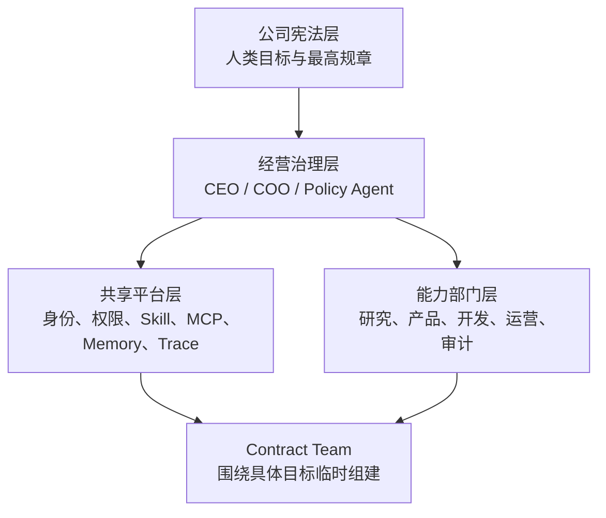
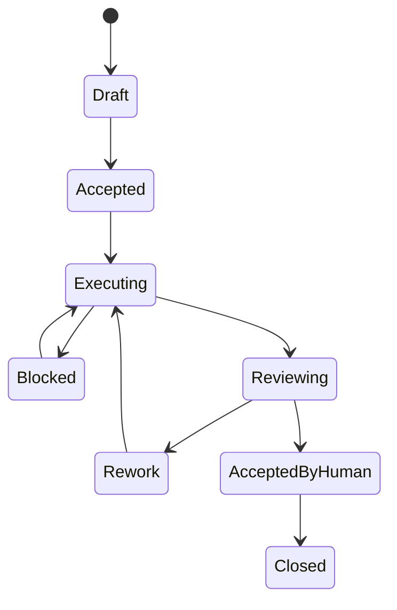

# 公司组织 — Agent 员工组织系统（愿景 PRD）

> **位置：** `公司组织/prd.md`（愿景草稿，尚未挂 Trellis task）  
> **状态：** brainstorm / draft  
> **日期：** 2026-07-12（产品边界修订：2026-07-13）  
> **一句话：** 以海尔式微型组织为结构、Amazon 式单一责任人为执行核心、GitLab 式 Handbook 为组织记忆、Netflix 式 Informed Captain 为决策机制、Toyota 式 Jidoka 为质量闭环的 **Agent 原生公司**。  
> **同源表述：** `d:\Projects\agent-jk\面试\Agm.md`（三链路 / 继承层 / 动作语言 / AGM）= 协作层写法。  
> **产品边界：** 这是 **新产品** 的组织愿景（**L1**），**不是**「把 CCB-Wanding 演进成平台」。技术栈四层见 `docs/platform-system-business-decoupling-optimization.md` **§0.1**：L1 产品层 → L2 Rudder 类控制面 → L3 包体系 → L4 CCB 样板垂直。

---

## Goal

打造 **Agent 员工组织系统**：不是普通互联网「职能部门制」的角色扮演，而是一套可运行的数字组织——

* **稳定部门** 提供能力（编制、Skill/MCP、SOP、质量标准）；
* **临时 Contract Team** 交付业务结果；
* **Contract** 是系统核心对象（不是 Chat / Session / 单个 Agent）；
* **公司宪法** 为最高约束；全程 Trace；资料/需求沉淀为 Skill / MCP；
* 人定目标与验收，Agent 执行；人↔人 / 人↔Agent / Agent↔Agent 三链路并存。

**设计第一原则：**

> 不要先设计「谁是谁的领导」，而要先设计「谁对什么结果负责、拥有什么权限、通过什么标准验收、失败时向谁升级」。

责任、权限、资源、验收、Trace 必须绑定到 Contract，否则只会做成「Agent 角色扮演公司」。

## 组织学说定位（混合，不可只抄一家）

最接近的底座 **不是** 普通互联网职能部门制，而是：

| 来源 | 借什么 | 不借什么 |
|------|--------|----------|
| **海尔「人单合一」**（重点研究） | 自组织、平台主/小微主/创客、面向用户价值的小单元、生态协同 | 内部市场计价、人类办公室政治/薪酬游戏 |
| **Amazon** | Single-Threaded Owner、小自治团队、护栏优于关卡 | 照搬「两张披萨」人数迷信 |
| **GitLab** | Handbook 中央知识库、DRI、制度可版本化追溯 | 为文档而文档 |
| **Toyota TPS** | JIT（按需）、Jidoka（异常即停）、Andon、标准化作业、Kaizen | 实体产线仪式感 |
| **Netflix** | Informed Captain、高度对齐松散耦合 | 文化海报空转 |

若只能选一家深挖：**先研究海尔**。若要做成系统：**必须混合**，不能只抄一家。

### 海尔概念 → Agent 系统

| 海尔 | Agent 员工系统 |
|------|----------------|
| 平台主 | 平台 Agent / 资源调度 Agent |
| 小微主 | 部门负责人 Agent |
| 创客 | 专业执行 Agent |
| 用户价值 | Contract 的最终业务目标 |
| 小微企业 | Agent 部门或临时任务团队 |
| 生态协同 | 跨部门 Agent Contract |
| 人单合一 | Agent 身份、任务、结果责任绑定 |

Agent 真正需要的是：**任务所有权、资源使用成本、权限边界、结果验收、失败责任与升级路径**——不是模拟人类办公室政治。

组织单位锁定：

> **稳定部门提供能力，临时 Contract Team 交付业务结果。**

## Problem

| 已有碎片 | 缺口 |
|----------|------|
| `wande-orchestrator` + 专家委派 | 偏路由；未产品化为治理层四职责 + Contract Owner |
| Work Tasks / RBAC | 有任务协作，缺 Contract 为核心对象 + 临时权限回收 |
| EIL | 真人员工身份；非 Agent 编制体系 |
| Routing vs Execution contracts | 运行时合约碎片；未升为宪法继承链 + Handbook |
| Skill / MCP | 能力在；缺部门维护责任制 + 资料→能力流水线 |
| View Steps / Delegation | 观测碎片；缺 AGM / Andon |

痛点：**对话式协作无法规模化**；缺责任-权限-验收-Trace 绑定。

---

## 一、混合组织四层架构



### 1. 公司宪法层

最高约束：**不属于任何 Agent**，不能被普通 Agent 修改。

应包含：

* 公司使命与禁止事项；
* 人类保留的最终权力；
* 数据安全与隐私政策；
* Agent 权限授予原则；
* 高风险操作审批线；
* 冲突时的规则优先级；
* 规则修改与版本生效机制。

**规则继承顺序（下层只能补充，不能覆盖上层）：**

```text
Company Constitution
→ Department Policy
→ Role Contract
→ Task Contract
→ Runtime Context
```

### 2. 经营治理层

不要设计一堆只会「转发消息」的管理 Agent。治理层 **只做四件事**：

1. 目标分解  
2. 资源分配  
3. 跨部门协调  
4. 异常升级  

借鉴 Netflix **Informed Captain**：重大决策指定一个掌握足够上下文的负责人，听取反对意见，但最终一人拍板（高度对齐、松散耦合）。  
参考：[Netflix Culture](https://jobs.netflix.com/culture)

| 角色 | 职责 |
|------|------|
| `CEO Agent` | 维护战略目标，不直接执行任务 |
| `COO / Orchestrator Agent` | 拆解目标、组建 Contract Team |
| `Informed Captain` | 重大决策唯一拍板人（可为人或指定 Agent+Human） |
| `Human Sponsor` | 目标设定者与最终验收者 |
| `Policy Agent` | 规章执行、拒规、权限匹配 |

v1 映射：治理能力先落在 `wande-orchestrator` + 策略，不必先造完整 CEO runtime。

### 3. 共享平台层

平台层 **不是部门**，是所有 Agent 的数字基础设施（人力/财务/IT/法务/档案的合并体）：

| 组件 | 作用 |
|------|------|
| Agent Registry | 员工身份、版本、职级、状态 |
| IAM | 权限、凭证、数据范围 |
| Skill Registry | 岗位能力 |
| MCP Registry | 可调用工具 |
| Knowledge / Memory | 组织知识 |
| Contract Engine | 任务契约与状态机 |
| Trace Center | 操作链路、决策依据 |
| Budget Center | Token、时间、API、并发预算 |
| AGM | 运行监控、异常、阻塞与升级（Andon） |

### 4. 能力部门层

部门负责 **培养与维护能力**，不直接代表一次任务交付。

| 部门 | 典型 Agent（可裁剪映射万鼎） |
|------|------------------------------|
| 战略研究部 | Researcher、Analyst、Industry Expert |
| 产品部 | PM、Requirement Analyst、UX Agent |
| 技术部 | Architect、Developer、Data Engineer |
| 运营部 | Content、Growth、Customer Success |
| 风控审计部 | Reviewer、Security、Compliance |
| 平台部 | Skill Engineer、MCP Engineer、AgentOps |

部门维护物：岗位说明书、可用 Skill/MCP、部门 SOP、质量标准、能力评估、入职/晋级/停用机制。

万鼎现状可先映射：报价 / 价库 / 名录 / 调研 / 工作任务 → 对应「能力部门」，不必照搬六部名称。

### 5. Contract Team

COO 按 Contract **临时**组建跨部门团队。借鉴 Amazon：

* 小型自治团队；
* 一个 **Single-Threaded Owner**；
* 负责人完整决策权；
* **Guardrails 控制风险**，而非层层审批。  
参考：[AWS Two-Pizza / accountability](https://aws.amazon.com/blogs/enterprise-strategy/two-pizza-teams-are-just-the-start-accountability-and-empowerment-are-key-to-high-performing-agile-organizations-part-2/)

```text
一个 Contract
→ 一个 Contract Owner（唯一交付负责人）
→ 一个临时 Agent Team
→ 一组交付物
→ 一套验收标准
→ 一个最终责任主体（Human Sponsor）
```

**禁止「多个 Agent 共同负责」。** 可共同参与；最终责任只能有一个。

---

## 二、Contract = 系统核心对象

系统不以 Chat、Session 或单个 Agent 为中心，而以 **Contract** 为中心。

### 最小结构

```yaml
contract:
  id: CONTRACT-2026-001
  objective: 要解决的业务问题
  human_sponsor: 最终目标与验收负责人
  owner_agent: 唯一交付负责人
  participants: 参与 Agent
  inputs: 输入资料和前置条件
  permissions: 可访问数据与可执行动作
  deliverables: 交付物
  acceptance_criteria: 可验证的完成标准
  budget:
    tokens:
    time:
    api_cost:
  dependencies: 上下游 Contract
  escalation_policy: 何时暂停并升级
  review_policy: 谁负责独立 Review
  trace_id: 全链路追踪标识
```

人↔Agent 四元组（目标 / 约束 / 权限 / 验收）是 Contract 对人侧的压缩视图；继承层七元组装入 Contract 字段。

### 状态机



### 硬规则

* Agent **接受 Contract 后**才获得对应权限；
* Contract **结束后临时权限自动回收**；
* 执行 Agent **不能**独立完成最终审计（Review / Human 分离）；
* `Blocked` 必须说明：缺失信息、影响、建议；
* `Closed` 后将经验提炼为 Skill、规则或案例（Kaizen）。

---

## 三、协作层（三链路 · Agm 同源）

```text
人 ↔ 人     → 高语境；落成可执行契约
人 ↔ Agent  → 授权与约束（非一问一答）
Agent ↔ Agent → 协议化对象流（动作语言）
```

```text
人  →  目标 / 约束 / 权限 / 验收标准
Agent  →  拆解 / 执行 / 回报 / 申请授权
```

| 消息 | 含义 |
|------|------|
| `ASK_FACT` | 请求事实，不允许推测 |
| `CLAIM` | 可验证结论 |
| `EVIDENCE` | 证据 |
| `PROPOSE` | 方案 |
| `COUNTER` | 反提案 / 收窄 |
| `COMMIT` | 承诺执行 |

**零信任：** 只信带证据的消息；裸 `CLAIM` 不能单独闭环。

### 继承层对象

意图 · 约束 · 权限 · 状态 · 证据 · 责任 · 规则  

与宪法继承链一致：规则冲突时上层优先。

---

## 四、执行与质量 · Toyota

| Toyota | Agent 系统 |
|--------|------------|
| Kanban | Contract / Task Queue |
| JIT | 下游按需拉取，不提前生成无用内容 |
| Jidoka | 权限/数据/置信度异常 **立即暂停** |
| Andon | AGM 异常告警与人工升级 |
| Standard Work | Skill、SOP、Action Language |
| Kaizen | 执行后规则提纯与 Skill 更新 |

学习闭环：

```text
Contract 执行
→ Trace 记录
→ Review 发现问题
→ 提炼可复用规则
→ 更新 Skill / Policy
→ 下一次 Contract 自动继承
```

参考：[Toyota Jidoka](https://www.toyota-global.com/company/vision_philosophy/toyota_production_system/jidoka.html)

### AGM 监控

| 链路 | 监控 |
|------|------|
| 人↔人 | 共识是否落成可执行契约 |
| 人↔Agent | 授权是否清晰 |
| Agent↔Agent | 消息合规、调用必要、权限匹配、循环、结果可证 |

AGM = AgentOps + Andon + 管理驾驶舱；v1 先 Trace 字段齐备。

---

## 五、制度与知识 · GitLab Handbook

Handbook 作为组织运行方式的中央知识库；**DRI** 明确每个项目/决策的最终负责人。  
参考：[GitLab Handbook](https://handbook.gitlab.com/handbook/)、[DRI](https://handbook.gitlab.com/handbook/people-group/directly-responsible-individuals/)

建议目录（可落在 `公司组织/`）：

```text
公司组织/
├── constitution/
│   ├── company-principles.md
│   ├── security-policy.md
│   └── authority-policy.md
├── departments/
├── roles/
├── contracts/
├── skills/
├── playbooks/
├── decisions/
└── retrospectives/
```

制度修改必须：有 DRI、修改原因、版本、生效范围、冲突检查、可追溯到 Contract 或 Review 证据。

---

## 六、现有概念在系统中的定位

| 概念 | 系统定位 |
|------|----------|
| 三链路 | 组织通信拓扑 |
| 继承层 / 宪法继承链 | 规则与上下文治理 |
| 动作语言 | Agent 之间的标准业务协议 |
| **Contract** | **组织运行的核心对象** |
| Contract Team | 临时交付编制 |
| 能力部门 | 常设能力池 |
| 共享平台 | 数字基础设施 |
| AGM | AgentOps、Andon、管理驾驶舱 |
| Skill / MCP | 员工能力与生产工具 |
| Trace | 审计、问责、组织学习依据 |

---

## Vision pillars（摘要）

四层组织 · 部门能力池 ≠ Contract Team · Contract 核心对象 · Single Owner · 宪法最高 · 三链路+动作语言 · Trace/AGM · Skill/MCP 沉淀 · 生命周期

## Assumptions

* v1 服务万鼎内部 AI 协作，不做 HR SaaS。
* 不照搬海尔内部市场/薪酬；要所有权、成本、权限、验收、升级。
* 部门名可裁剪映射万鼎专家编制。
* Contract Team v1 可先映射 Guid/Work Task 委派图，再实体化。
* 治理层 v1 映射 orchestrator，不先造完整 CEO Agent。
* 重点研究顺序：海尔（结构）→ Amazon（责任）→ 其余按需。

## Requirements（evolving）

### Must

1. 四层模型文档与实现隐喻一致。  
2. **Contract 为核心对象**（最小 YAML 字段 + 状态机）。  
3. 每个 Contract：**Human Sponsor + Owner Agent（单一）+ 验收标准 + trace_id**。  
4. 接受 Contract 才授权；结束后回收临时权限。  
5. 执行与最终审计分离；Blocked 必填原因。  
6. 动作语言 + 零信任证据规则。  
7. 平台至少：身份、权限、Skill/MCP、Memory、Trace。  
8. Closed → 可沉淀 Skill/Policy（学习闭环）。  

### Should

9. Handbook 目录 + 制度 DRI/版本。  
10. Budget（token/时间/API）。  
11. AGM / Andon。  
12. 部门岗位说明书与入职/停用。  
13. Informed Captain 决策记录。  

### Could

14. 独立 Policy / CEO Agent runtime。  
15. 专用消息总线。  
16. 多租户公司模板。  
17. 完整 Health Dashboard。  

## Acceptance Criteria（愿景级）

- [ ] 学说定位写清：海尔底座 + Amazon 责任 + GitLab 记忆 + Netflix 决策 + Toyota 质量  
- [ ] 四层图 +「部门 ≠ Contract Team」无歧义  
- [ ] Contract 最小 schema + 状态机冻结  
- [ ] 硬规则：授权绑定 / 权限回收 / 单 Owner / Review 分离  
- [ ] 宪法继承链：下层不覆盖上层  
- [ ] 与 EIL / Work Tasks / Routing-Execution 边界图  
- [ ] 一条「资料→Skill/MCP」演示闭环  
- [ ] Open Questions ≤3  

## Out of Scope

* 完整 HR（薪酬/考勤/招聘）— **尤其不模拟海尔内部市场结算**  
* Agent 办公室政治 / 闲聊人格 / 角色扮演公司壳  
* 一上来完整消息中间件  
* 只抄一家公司组织的教条实现  

## Technical Notes / 关联

| 主题 | 指针 |
|------|------|
| 协作层 | `d:\Projects\agent-jk\面试\Agm.md` |
| 海尔人单合一 | https://www.haier.com/global/press-events/news/20170329_142535.shtml |
| Netflix Culture | https://jobs.netflix.com/culture |
| Amazon accountability | AWS enterprise strategy · two-pizza / STO |
| Toyota Jidoka | https://www.toyota-global.com/company/vision_philosophy/toyota_production_system/jidoka.html |
| GitLab Handbook / DRI | handbook.gitlab.com |
| EIL | `.trellis/tasks/07-14-employee-intelligence-layer/` |
| Routing/Execution | `.trellis/tasks/07-09-07-09-work-routing-execution-contracts/` |
| 本 PRD | `公司组织/prd.md` |
| 平台工程/解耦（L3；§0.1 四层栈） | `docs/platform-system-business-decoupling-optimization.md` |
| Rudder（L2 参考） | https://github.com/Undertone0809/rudder |
| Routing/Execution 映射 | `.trellis/spec/integration/work-routing-execution-contracts.md` |

## Open Questions

1. **MVP 切口**：A Contract Engine（对象+状态机+权限绑定）· B 共享平台 Registry/Trace · C Handbook/宪法骨架 · D 资料→Skill —— 推荐优先 **A**，因其定义「可运行」；确认？  
2. Agent 编制与 **真人 EIL**：同构一张图，还是两套并行、经 Contract/Work Tasks 交汇？  
3. 宪法权威载体：repo Handbook · Org 知识库 · contract registry 配置 —— Policy Agent 读哪里？

---

## 原始笔记（压缩保留）

```text
人单合一底座 + Amazon STO + GitLab Handbook + Netflix Informed Captain + Toyota Jidoka
稳定部门提供能力；临时 Contract Team 交付结果
Contract 核心对象；单 Owner；权限随约授予/回收
不要先设计领导关系，先设计责任/权限/验收/升级
三链路 + 继承层 + 动作语言 + AGM（见 Agm.md）
```
